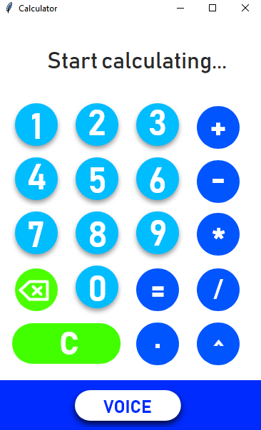
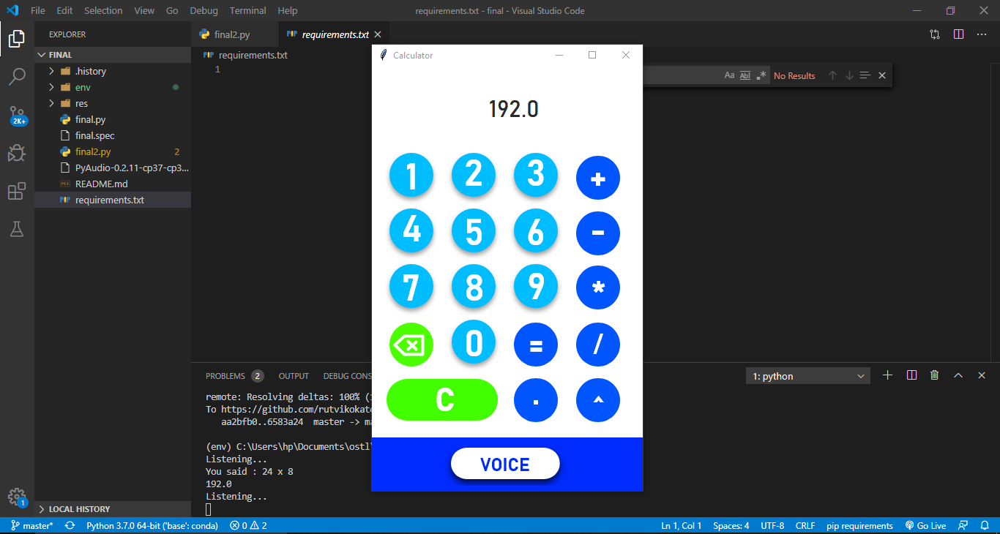

# Python_Voice_Calculator
1.Run <b>pip install requirements.txt</b> to install all dependencies 
2.Run <b>python final2.py</b> to run the app. 
3.Python3.7 recommended 
 
## What it can do?
This app can perform all basic arithmetic operations either by typing manually or by recognizing your voice.
 

 

